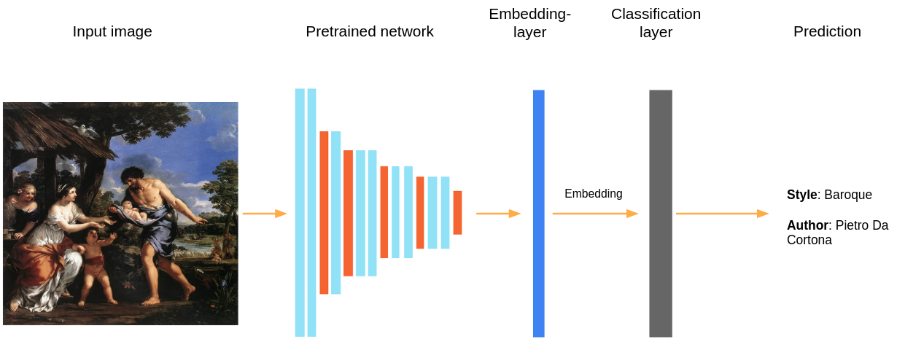
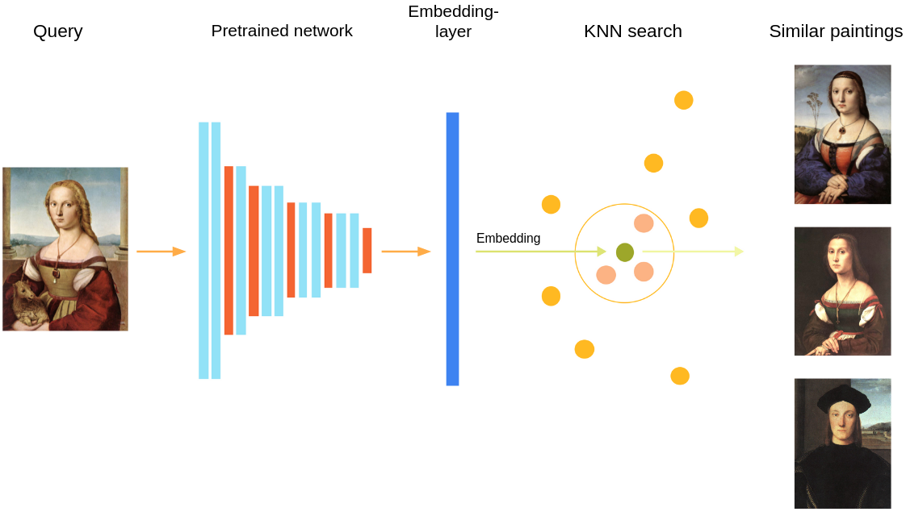
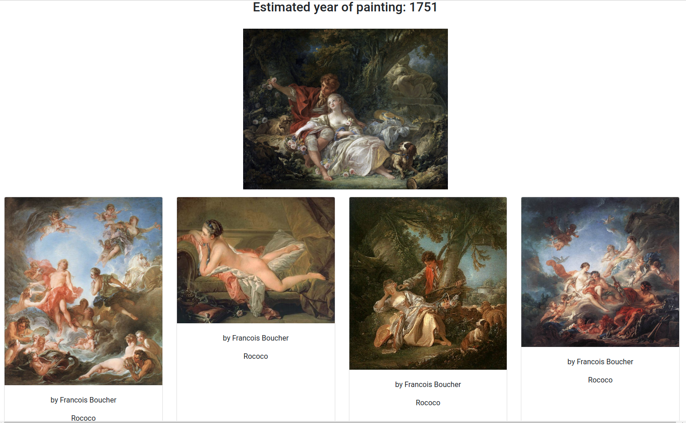
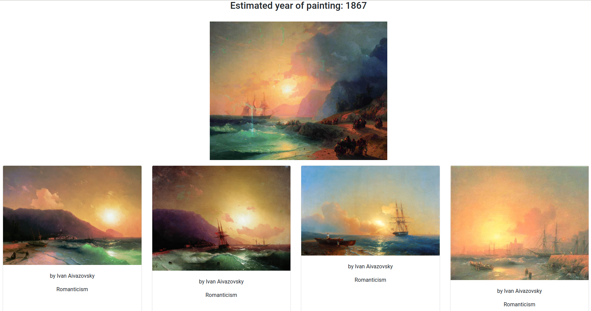
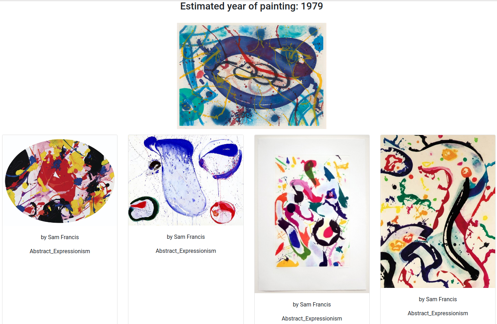

# Search for similar paintings

**In scope of this project, a search for similar paintings and determination of the year of painting were implemented. For ease of use, you can try a Flask app or [telegram bot](https://telegram.me/ssu_artworks_bot) (please ping me if I disabled the bot and you want to test it).**

### 1. Data:
Images and meta-information from the [wikiart.org](https://www.wikiart.org/) were used as data for training and search. As a class, the intersection of the author and the style of the painting was used, since it is precisely such paintings that are most similar to each other.

Dataset:
- ~80000 images
- 1119 authors
- 27 styles
- 2108 classes

### 2. Model training:
EfficientNet-b0 is used as a backbone to train the model. The ArcFace architecture ([original article](https://arxiv.org/abs/1801.07698v3)) is used as the head.
I recommend to unfreeze all the weights gradually (maybe just keep the weights from the very first layers of the backbone).


### 3. Inference:
Faiss index is used to store and quickly search for embeddings.


## How to use
### 1. Install requirements:
- clone repo
- `$ pip install -r requirements.txt`

If you are facing `AttributeError: module 'yaml' has no attribute 'safe_load'` problem, try:

`$ pip install --ignore-installed PyYAML`

You can install faiss-cpu instead of faiss-gpu if your computer doesn't have a gpu (check [requirements.txt](requirements.txt) and [configs/](configs) to change it). 

### 2. Download data and models
Data: [WikiArt dataset](https://github.com/cs-chan/ArtGAN/tree/master/WikiArt%20Dataset)

Models: [Trained models](https://drive.google.com/drive/folders/1PTJ06eNEwI4uPNpkOH6XydSu6VQojN-Z?usp=sharing) 

You need to unzip "data.zip" in [static/](static) and put the "models" folder in the root.

### 3. Run application
Run below from root:

`$ python -m app`

You can change settings using [application config](configs/application_config.yaml).

## Train classifier model*
This is not necessarily part, but you can train the model yourself.

### 1. Folders and files structure
You need a folder with your data in [static/](static). This folder should contain csv files (train.csv, valid.csv and etc) and data folder.  

Folder structure:
```bash
├── static
    └── data
        ├── csv
        │   ├── train.csv
        │   ├── test.csv
        │   └── valid.csv
        └── data
            ├── folder_name_1
            │   └── img.jpg
            ├── folder_name_2
            │   └── img.jpg
            └── folder_name_3
                └── img.jpg
```
Your csv files should contain a column with names of the image folders. Example for structure above:
```
imgId           class
folder_name_1   name_1
folder_name_2   name_2
folder_name_3   name_3
```
### 2. Run training
Run below from root:

`$ python -m searchplates.train_classifier`

You can change settings using [training config](configs/train_classifier.yaml).

## Examples
Above is a picture-request, and below - four similar images from dataset.

*Shepherd and Shepherdess (Boucher Francois, 1760)*


*Crete (Ivan Aivazovsky, 1867)*


*Trietto II (Sam Francis, 1991)*
