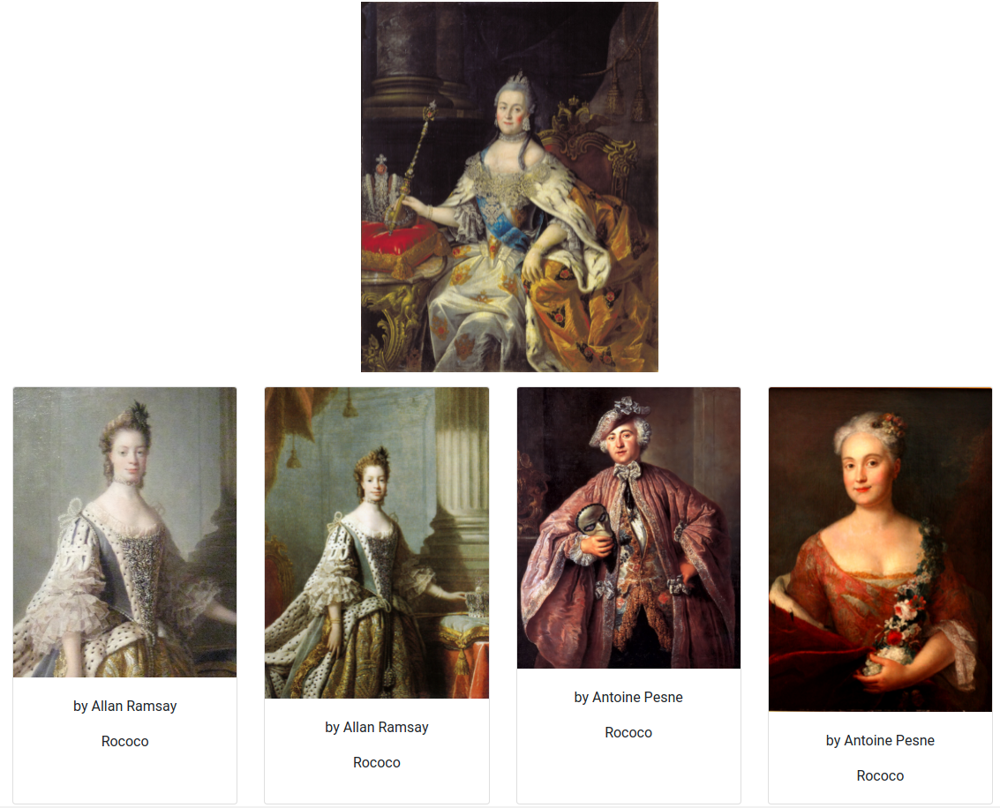
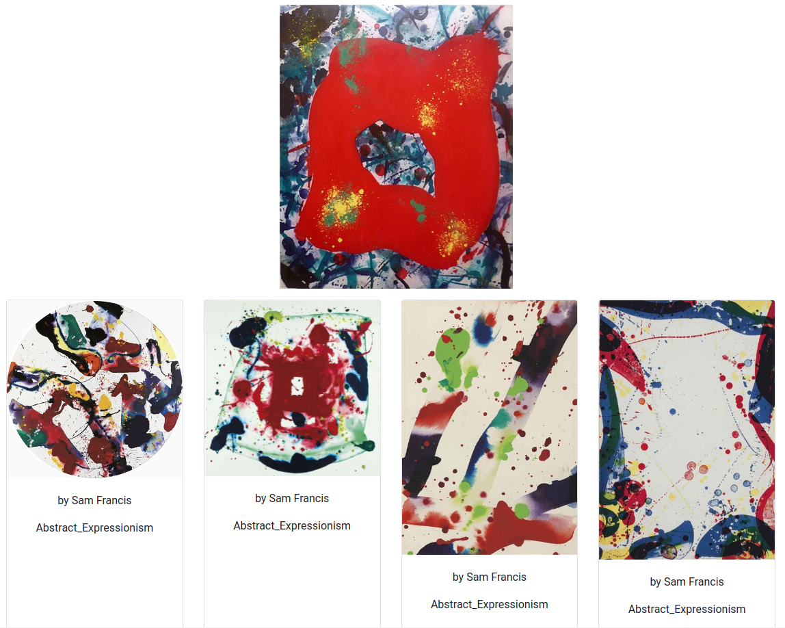

# Search for similar paintings [Work In Progress]

In scope of this project we are implementing style recognition in paintings.

## Requirements
Python 3.8

## Installation
`pip install -r requirements.txt`


If you are facing `AttributeError: module 'yaml' has no attribute 'safe_load'` problem. Try: 

`pip install --ignore-installed PyYAML`

You can install faiss instead of faiss-cpu if your computer has a gpu (check requirements.txt and /configs to start using it). 

## Data and models
Data: [WikiArt dataset](https://github.com/cs-chan/ArtGAN/tree/master/WikiArt%20Dataset)

Models: [Trained models](https://drive.google.com/drive/folders/1PTJ06eNEwI4uPNpkOH6XydSu6VQojN-Z?usp=sharing) (In the future, new versions of the models will be added)

You need to unzip "data.zip" in `/static` and put the "models" folder in the root

## Run application
Run below from root:

`python -m app`

You can change settings using `configs/application_config.yaml`

## Train classifier model
### Folders and files structure
You need a folder with your data in `/static`. This folder should contain csv files (train.csv, valid.csv and etc) and data folder.  

Folder structure:
```bash
├── static
    └── data
        ├── csv
        │   ├── train.csv
        │   ├── test.csv
        │   └── valid.csv
        └── data
            ├── folder_name_1
            │   └── img.jpg
            ├── folder_name_2
            │   └── img.jpg
            └── folder_name_3
                └── img.jpg
```
Your csv files should contain a column with names of the image folders. Example for structure above:
```
imgId           class
folder_name_1   name_1
folder_name_2   name_2
folder_name_3   name_3
```
### Run training
Run below from root:

`python -m searchplates.train_classifier`

You can change settings using `configs/train_segmentation.yaml`

## Examples



